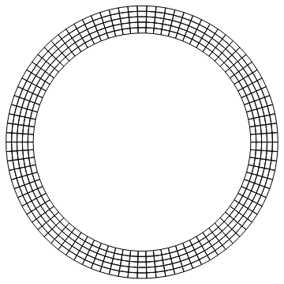
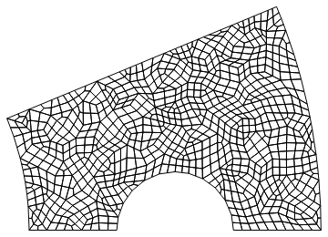
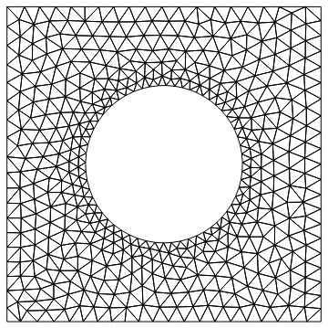

# FEMAddOns for the Wolfram Language

The [Wolfram Language](https://www.wolfram.com/language/) has build in support for the Finite Element Method. FEMAddOns is a package that provides additional Finite Element Method functionality. FEMAddOns supports 11.3 and later versions of Wolfram Language deployments for the desktop, including [Wolfram Desktop](https://www.wolfram.com/desktop/) and [Mathematica](https://www.wolfram.com/mathematica/).

### Installing the FEMAddOns release

The FEMAddOns release comes in the form of a `.paclet` file, which contains the entire package and its documentation. Download the latest release from the [Github repo's releases page](https://github.com/WolframResearch/FEMAddOns/releases). To install, run the following command in the Wolfram Language:

    PacletInstall["/full/path/to/FEMAddOns.paclet"]

This will permanently install the FEMAddOns paclet. The Wolfram Language will always use the latest installed version of FEMAddOns. Installed versions can be enumerated using the command:

    PacletFind["FEMAddOns"]

And all versions can be uninstalled using the command:

    PacletUninstall["FEMAddOns"]

To make use of the documentation it may be necessary to restart.

### Using FEMAddOns

To access the documentation, open the notebook interface help viewer, and search for FEMAddOns. The first hit will be a summary page enumerating the most commonly used functions in FEMAddOns. 

For example generate structured meshes with `StructuredMesh`:

	raster = Table[#, {fi, 0, 2 Pi, 2 Pi/360}] & /@ {{Cos[fi], Sin[fi]}, 0.8*{Cos[fi], Sin[fi]}};
	mesh = StructuredMesh[raster, {90, 5}];
	mesh["Wireframe"]

With `ToQuadMesh` convert triangle meshes into quadrilateral meshes:

	region = ImplicitRegion[And @@ (# <= 0 & /@ {-y, 1/25 - (-3/2 + x)^2 - y^2, 
       1 - x^2 - y^2, -4 + x^2 + y^2, y - x*Tan[Pi/8]}), {x, y}];
	ToQuadMesh[ToElementMesh[region]]["Wireframe"]

Use the `DistMesh` mesh generator to create smooth meshes:

	mesh = DistMesh[RegionDifference[Rectangle[{-1, -1}, {1, 1}], Disk[{0, 0}, 1/2]], 
	   "DistMeshRefinementFunction" -> 
	    Function[{x, y}, Min[4*Sqrt[Plus @@ ({x, y}^2)] - 1, 2]], 
	   "MaxCellMeasure" -> {"Length" -> 0.05}, 
	   "IncludePoints" -> {{-1, -1}, {-1, 1}, {1, -1}, {1, 1}}]; 
	mesh["Wireframe"]

Use `DomainDecomposition` to solve stationary PDEs on a cluster:

	kernels = LaunchKernels[24];
	DecompositionNDSolveValue[{Laplacian[u[x, y], {x, y}] == 1, 
	  DirichletCondition[u[x, y] == 0, 
	   x == 0 || x == 5 || y == 0 || y == 1]}, u, Element[{x, y}, 
	  Rectangle[{0, 0}, {5, 1}]], "Kernels" -> kernels]

### More...

See the following files for more information:

* [License.md](License.md) - FEMAddOns license
* [Contributing.md](Contributing.md) - Guidelines for contributing to FEMAddOns
* [HowToBuild.md](HowToBuild.md) - Instructions for building and debugging FEMAddOns
